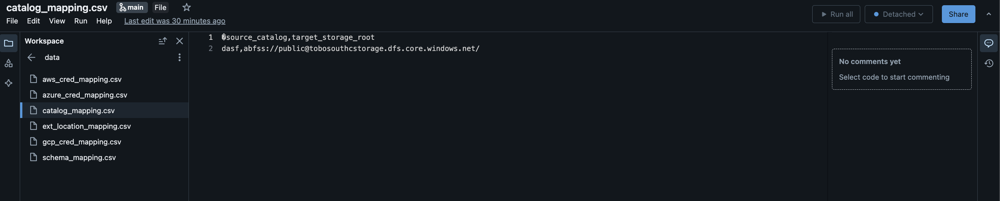
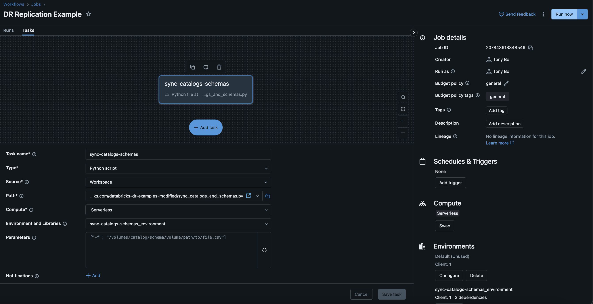

## Example: Creating a Databricks Workflow
In this section, we'll demonstrate how you can run one of the above scripts in a workflow fashion within Databricks. In this example we will be creating a workflow using the sync_catalogs_and_schemas.py. 

*This workflow assumes that you've done the prerequisites by ensuring that the external locations and credentials are already created/synced.*

1. In the Databricks UI, navigate to the Workspace Tab in the UI, click create Git Folder from the right hand side, and add in this repository

2. Inside the newly created Git Folder, navigate to the common.py folder and make the appropriate edits for your environment. ie. Change cloud_type to your corresponding cloud provider, set your source_host, source_pat, target_host, target_pat, and the catalogs you want to replicate

3. Inside the git folder, navigate to the data directory and edit the catalog_mapping.csv and schema_mapping.csv directly or download into your csv editor. If you downloaded the files to edit, ensure you bring the newly editted file back into this folder.

4. Inside the Databricks UI, on the left hand side navigate to workflows, and create a new job with the following information:

5. In the above screenshot we set the type to python script, source is workspace, and we selected the path of the sync_catalogs_and_schemas.py in our git folder. You can use serverless or classic compute, but ensure that there is network connectivity from the compute to the databricks front end api.

6. Under Environments and Variables, select the drop down and configure a new environment with the requests and databricks-sdk library. Click Confirm and Click Create Task.

7. Click Run Now:

8. The successful run should yield similar results:

 