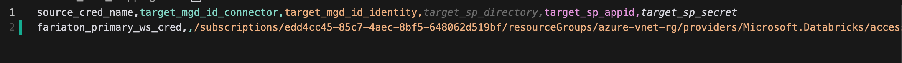
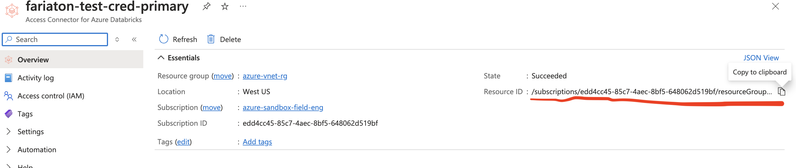

# Azure Usage Guide

## Overview
This guide provides instructions and examples on configuring the Databricks Metastore Replication Tool, and where to find the relevant values.

The tool uses several configuration files and settings defined in `common.py`:

### Core Settings
- Cloud Platform: Azure
- Source Workspace: e.g. adb-3960987466318833.13.azuredatabricks.net
- Target Workspace: e.g. adb-1586766716853906.6.azuredatabricks.net
- Metastore ID: e.g. 7215a9fc-0933-4efd-b718-c2fd8ac512b9

### Mapping Files
- Credential Mapping: `data/azure_cred_mapping.csv`
- External Location Mapping: `data/ext_location_mapping.csv` 
- Catalog Mapping: `data/catalog_mapping.csv`
- Schema Mapping: `data/schema_mapping.csv`

## Populating azure_cred_mapping.csv

This file maps Unity Catalog Credentials

- source_cred_name: name of UC credential you are copying
- target_mgd_id_connector: populate this Azure resourceID  OR
- target_mgd_id_identity: populate this Azure resourceID (see example screenshot) OR
- target_sp_directory: populate this location for Service Principal and the other Service Principal fields below
- target_sp_appid: AppID for Service Principal
- target_sp_secret: Secret for Service Principal

*Example mapping file for UC Credentials*

*Example of where to find the  Resource ID for the Access Connector in Azure (target_mgd_id_identity)*

## Populating ext_location_mapping.csv

- source_loc_name: UC name of external location to copy over
- target_url: container to be used as target for external location
- target_access_pt: Not Used For Azure

## Populating catalog_mapping.csv

## Populating schema_mapping.csv

